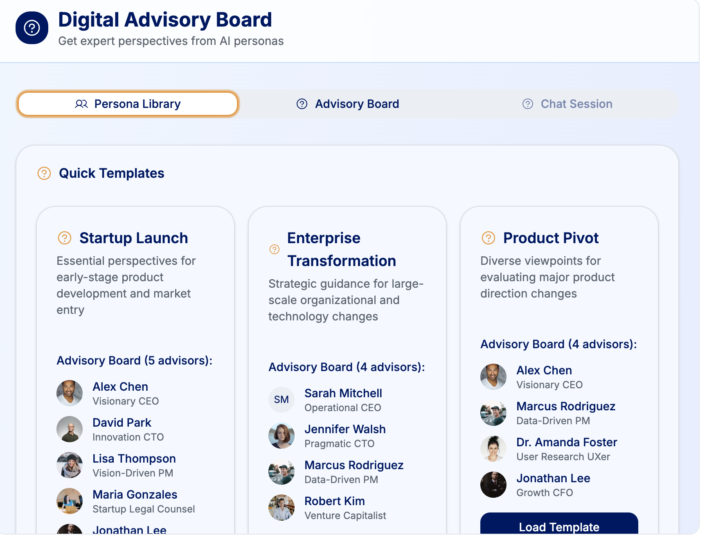

# Digital Advisory Board

This is a customizable chat application comprising a panel of experts. Users can assemble advisory panels from a collection of 60+ persona archetypes, each representing real-world roles across leadership, technology, design, business, law, finance, and more.

## Dashboard View

## Key Features

- **Expert Persona Library**: Choose from over 60 detailed persona archetypes, including:
  - C-suite executives (CEO, CTO, CMO, CFO, CLO, etc.)
  - Engineering & product leaders
  - Legal & compliance advisors
  - Financial analysts and strategists
  - Operational experts
  - UX designers and product managers
  - Emerging tech specialists (AI, cybersecurity, data science, etc.)

- **Custom Advisory Panels**: Create your own virtual boardroom by selecting advisors relevant to your challenge or domain.

- **Perspective-Based Responses**: Submit a topic or question and receive tailored responses from each advisor based on their role, expertise, and strategic lens.

- **Scenario Simulation**: Stress-test decisions by prompting advisors with hypothetical or real-world scenarios.

- **Decision Support**: Use the insights gathered to inform product strategy, risk assessments, stakeholder alignment, or high-level planning.

## Example Use Cases

- **Startup Founders**: Test your go-to-market strategy with a virtual CMO, COO, and Head of Product.
- **Design Leaders**: Balance UX and business goals by consulting a design lead, marketing strategist, and CFO.
- **Engineering Managers**: Evaluate a new architecture choice with a CTO, security lead, and head of infrastructure.

## Persona Categories

- **Executive Leadership**: CEO, COO, CMO, CTO, CFO, CLO, CHRO, CPO, etc.
- **Technology & Engineering**: Principal Engineer, Staff Engineer, SRE Lead, Platform Architect, AI/ML Lead
- **Product & Design**: Product Manager, Head of UX, Design Systems Lead
- **Business & Operations**: Ops Manager, Revenue Strategist, Growth Lead
- **Finance & Legal**: General Counsel, Compliance Officer, FP&A Analyst, M&A Advisor
- **Specialized Experts**: AI Ethicist, DEI Officer, Cybersecurity Advisor, Customer Success Lead

## How It Works

1. **Select Personas**: Browse and choose relevant experts from the persona catalog.
2. **Submit a Topic**: Enter your question, challenge, or idea.
3. **Get Feedback**: Each selected advisor responds with perspective-rich insights based on their role and expertise.
4. **Iterate**: Refine your advisory panel or follow up with additional questions to dive deeper.

## Simulation

Try it [here](https://gh.io/digital-advisory-board).

## License

MIT License. See `LICENSE.md` for details.
